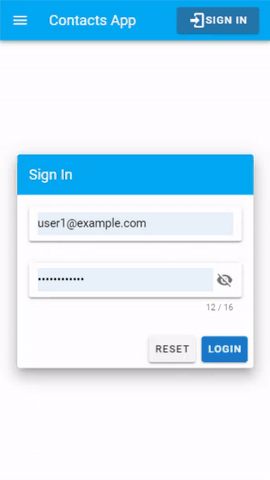

## PROJECT TECHNOLOGIES

- [Vue JS](https://vuejs.org/).
- [Json-server](https://www.npmjs.com/package/json-server/).

<a href="https://contacts-demo-vue.herokuapp.com/">DEMO</a>
<p align="left">
  
</p>

## DEVELOPERS INFO

- [Nurbek Ismoilov <dataproger@gmail.com> <nuronbeck@gmail.com>](https://facebook.com/nuronbeck/).

## PROJECT INSTALLATION

- CLONE REPOSITORY

```
git clone https://github.com/nuronbeck/contacts_demo.git
```

```
cd contacts_demo
```

- INSTALL DEPENDENCIES

```
npm install
```

## USE 2 TERMINALS:

- RUN FAKE SERVER API

```
json-server db.json
```

- RUN CLIENT APP

```
npm run serve
```

## OPEN THE APP:

[http://localhost:8080/](http://localhost:8080/)
